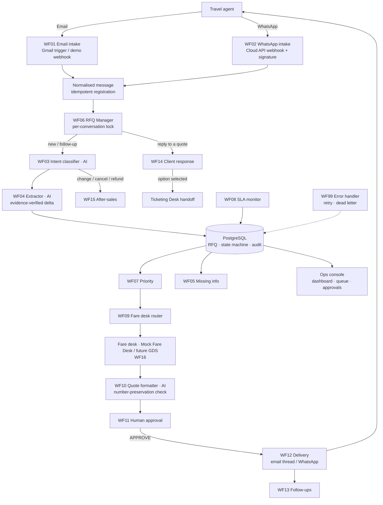

# Offshore Fares — AI Travel Operations Orchestrator

> Proof of concept · n8n + PostgreSQL + OpenAI · Email & WhatsApp · human-controlled AI

A travel agent sends an unstructured request by **email or WhatsApp**. The platform understands it, extracts the travel requirements, asks only for what is missing, creates a structured **RFQ** (`OFF-RFQ-2026-000031`), scores its priority, routes it to the right fare desk, tracks the SLA, takes the fare desk's options, formats a professional quote, **waits for human approval**, sends it on the agent's channel, follows up, understands the reply ("Option 2 works, please proceed") and hands the booking to the ticketing team. Every step is stored and auditable.

The AI never invents fares, availability, penalties or booking confirmations. Those come only from the fare desk (later a GDS / NDC adapter), and every AI output is checked by code.

---

## Contents
1. [Project overview](#1-project-overview)
2. [Business problem](#2-business-problem)
3. [Solution](#3-solution)
4. [Architecture](#4-architecture)
5. [Features](#5-features)
6. [Tech stack](#6-tech-stack)
7. [Workflows](#7-workflows)
8. [Database](#8-database)
9. [Installation](#9-installation)
10. [Configuration](#10-configuration)
11. [Demo](#11-demo)
12. [Security](#12-security)
13. [Limitations](#13-limitations)
14. [Production roadmap](#14-production-roadmap)
15. [Future GDS integration](#15-future-gds-integration)

---

## 1. Project overview

| | |
|---|---|
| Client | **Offshore Fares**: international and premium-cabin fares for travel agents (B2B) |
| Goal | Automate the email and WhatsApp request flow without losing human control over prices |
| Status | Working POC: 18 n8n workflows, 37 PostgreSQL API functions, ops console, demo data, automated tests |
| Run it | `cp .env.example .env` → `npm run demo` → http://localhost:3000 · readiness: [READY_FOR_DEMO.md](READY_FOR_DEMO.md) |

## 2. Business problem

Agents send requests such as *"need 3 biz BOM-LHR 17 Nov ret 25th, QR pref, urgent"* by email and WhatsApp, often spread over several messages. Today the team:

- reads every message, works out the itinerary, dates, passengers and cabin, and chases the missing details;
- forwards it to the right operator, copies fares into emails, and rewrites the same quote for WhatsApp;
- remembers to follow up, and keeps track of what was sent where.

Requests get forgotten, response times vary, and nobody has a consolidated view of the work.

## 3. Solution

| Step | What happens | AI? |
|---|---|---|
| Intake | Gmail / WhatsApp Cloud API → common message format, de-duplicated | – |
| Understand | Intent classification + travel requirement extraction (OpenAI Structured Outputs) | ✅ verified by code |
| Complete | Missing fields detected deterministically; one short clarification (debounced for WhatsApp bursts) | – |
| Structure | RFQ created or **merged** (5 WhatsApp messages → 1 RFQ), state machine enforced in the DB | – |
| Prioritise & route | Explainable rules (travel < 24 h, cabin, group, VIP, urgency) → Premium / Group / Ticketing / Refund desk | – |
| Fares | Fare desk enters options (Mock Fare Desk today, GDS adapter later) | – |
| Quote | AI writes email + compact WhatsApp; **any altered or invented number → rejected**, template used instead | ✅ guarded |
| Approve | Human APPROVE / EDIT / REJECT, versioned, with who, when and the SHA-256 of the exact text | – |
| Deliver | Same channel as the agent, same email thread, WhatsApp 24 h rule respected | – |
| Follow up | 4 h / 24 h, stops on reply, booking, opt-out; expired fares never presented as valid | – |
| Reply | "option 2", "second one", "book Qatar", "too expensive", "change dates to 18th"… | ✅ + evidence check |
| Handoff | BOOKING_REQUESTED → Ticketing Desk summary. **No automatic ticketing.** | – |

## 4. Architecture



More detail in [docs/architecture.md](docs/architecture.md).

**Design principles:** modularity (one workflow per responsibility), idempotency (unique message IDs, DB claims), observability (`workflow_events`, `audit_logs`), human control (approval, review tasks), data validation (everything the AI returns is checked), security (secrets only in n8n credentials), channel independence, AI only where it adds value, and deterministic rules wherever possible.

## 5. Features

- **Omnichannel intake**: Gmail (shared inbox), WhatsApp Business **Cloud API** (official, with verification handshake, `X-Hub-Signature-256` and delivery receipts), and demo webhooks.
- **Idempotency**: an email or WhatsApp message is stored once (`UNIQUE (channel, external_message_id)`); follow-ups and SLA alerts can't be duplicated.
- **Conversation correlation & request merging**: email thread, RFQ number in the subject, WhatsApp number, and cross-channel replies. A per-conversation DB lock processes WhatsApp bursts in order.
- **AI understanding with guardrails**: strict JSON Schema, temperature 0, messages wrapped as untrusted data, and every value re-verified against the text. Ambiguous dates ("next week", "next Friday") are never converted.
- **Business state machine**: 20 statuses with allowed transitions enforced by PostgreSQL (`NEW → TICKETED` is refused).
- **Priority & SLA**: explainable scoring and per-status SLAs (tighter for CRITICAL), with one alert per breach.
- **Mock Fare Desk**: validated fare entry (amount, currency, penalties, baggage, validity), plus a sample-fare generator for demos.
- **Quote engine**: email and compact WhatsApp versions. Numbers are formatted by code, checked after AI generation, with a template fallback.
- **Human approval**: approve / edit / reject, versioning, and edit warnings when a human changes a price.
- **Delivery**: channel preference, same email thread, WhatsApp session window and templates, delivery status.
- **Follow-ups**: polite, capped, cancelled on reply, booking or opt-out ("STOP"); expired quotes trigger a RECHECK_FARE task.
- **Reply understanding**: option selection with an evidence check, ambiguity triggers a confirmation question, price objections go back to the desk without inventing a discount, and pre-booking changes trigger a requote.
- **After-sales**: change / cancellation / refund become human tasks linked to the booking (PNR). Never an automatic penalty.
- **Security**: prompt-injection screening and alerts; secrets never reach the model or the workflow JSON.
- **Ops console**: KPIs, live RFQ queue, client journey timeline, approval screen, desk inbox, outbox, activity log, dead letters and the demo simulator.
- **Error handling**: OpenAI failure falls back to rules, retries on DB / Gmail / WhatsApp, and an error workflow with backoff (1/5/15 min) and a dead letter queue.

## 6. Tech stack

| Layer | Choice |
|---|---|
| Orchestration | **n8n 2.41** (self-hosted, Docker), official nodes: Webhook, Gmail, Postgres, HTTP Request, Execute Workflow, Schedule, Error Trigger |
| AI | **OpenAI** Chat Completions + Structured Outputs, configurable `OPENAI_MODEL` (default `gpt-4.1-mini`) |
| Data | **PostgreSQL 16**: schema + transactional jsonb API (`of_*` functions) |
| Channels | Gmail (OAuth2) · WhatsApp Business Cloud API (Graph API) |
| Business logic | Plain JavaScript (`lib/`), unit-tested and bundled into n8n Code nodes by the build |
| Console | Node.js + vanilla JS (no framework), read-only DB role |
| Redis | Not used: locks, idempotency and queues are handled in PostgreSQL (simpler for a POC) |

## 7. Workflows

| # | Workflow | Role |
|---|---|---|
| WF01 | `WF01_EMAIL_INTAKE` | Gmail trigger / demo webhook → normalise → idempotent registration → WF06 |
| WF02 | `WF02_WHATSAPP_INTAKE` | Cloud API verification + events, signature, statuses, → WF06 |
| WF03 | `WF03_INTENT_CLASSIFIER` | 12 intents, strict JSON, confidence < 0.70 → human |
| WF04 | `WF04_TRAVEL_REQUEST_EXTRACTOR` | Delta extraction + evidence verification |
| WF05 | `WF05_MISSING_INFORMATION_HANDLER` | Debounced, deduplicated clarification + escalation |
| WF06 | `WF06_RFQ_MANAGER` | Core orchestrator (route, merge, create/update RFQ, sweeper) |
| WF07 | `WF07_PRIORITY_ENGINE` | Deterministic score / level |
| WF08 | `WF08_SLA_MONITOR` | Per-minute SLA scan, deduplicated alerts |
| WF09 | `WF09_FARE_DESK_ROUTER` | Desk rules + least-loaded operator |
| WF10 | `WF10_QUOTE_FORMATTER` | AI quote + number check + versioned quote |
| WF11 | `WF11_HUMAN_APPROVAL` | APPROVE / EDIT / REJECT webhook |
| WF12 | `WF12_QUOTE_DELIVERY` | Outbound gateway (simulate / Gmail reply / WhatsApp) |
| WF13 | `WF13_FOLLOWUP_ENGINE` | Follow-ups with all stop conditions |
| WF14 | `WF14_CLIENT_RESPONSE_HANDLER` | Selection / hold / objection / change / decline |
| WF15 | `WF15_AFTER_SALES_ROUTER` | Change / cancellation / refund tasks |
| WF16 | `WF16_FARE_DESK_INTAKE` | Mock Fare Desk / ManualFareProvider |
| WF17 | `WF17_OPERATOR_ACTIONS` | Start search, ticketing, PNR, close, resend, retry… |
| WF99 | `WF99_ERROR_HANDLER` | Error log, retry with backoff, dead letter |

Node-by-node descriptions: [docs/workflows.md](docs/workflows.md). The JSON files in `n8n/` are **generated** by `npm run build` from `scripts/build-workflows.js`, `lib/` and `prompts/`.

## 8. Database

19 tables: `agencies`, `contacts`, `conversations`, `messages`, `rfqs`, `rfq_segments`, `rfq_passengers`, `rfq_status_history`, `fare_options`, `quotes`, `quote_options`, `approvals`, `assignments`, `followups`, `alerts`, `workflow_events`, `audit_logs`, `workflow_errors`, `knowledge_base`. There are also the reference tables `rfq_statuses`, `rfq_status_transitions`, `desks`, `operators` and `rfq_counters`.
Every business write goes through a transactional function (`of_register_inbound_message`, `of_upsert_rfq_from_message`, `of_transition_rfq`, `of_quote_decision`, …). Details in [docs/database.md](docs/database.md).

## 9. Installation

Prerequisites: Docker Desktop (or Docker Engine + Compose v2) and Node.js 20+ (only for tests and builds).

```bash
cp .env.example .env          # set the passwords, N8N_ENCRYPTION_KEY, OPS_API_TOKEN (+ OPENAI_API_KEY for real AI)
npm run stack:up              # docker compose up -d --build, then waits until n8n + console are ready
                              # (first start ~6–9 min: imports and publishes 18 workflows)
```
All services have health checks (`docker compose ps` → *healthy*). Console: `GET /health` (process + database) and `GET /ready` (database + n8n).

### Commands (all cross-platform: Windows, macOS, Linux)

| Command | What it does |
|---|---|
| `npm run demo` / `npm run demo:step` | starts the stack if needed, resets demo data, plays the client story (step-by-step variant pauses for live presentation) |
| `npm run demo:reset` | restores the demo data in seconds (refused when `DEMO_MODE=false`) |
| `npm run demo:rebuild` | wipes all volumes and rebuilds from scratch |
| `npm run verify` | **master check**: lint, build, config, secret scan, unit, stack health, deployed workflows, SQL, reset → E2E → reset → E2E, OpenAI smoke → PASS/FAIL table |
| `npm run verify:quick` | same without Docker (lint, build, config, secrets, unit) |
| `npm test` · `npm run test:sql` · `npm run test:e2e` | unit / SQL API / end-to-end |
| `npm run smoke:openai` (`:stack`) | real OpenAI check with your key (key never printed) |
| `npm run config:check` · `npm run security:scan` | configuration rules · exposed-secret scan |
| `npm run build` · `npm run workflows:reimport` | regenerate `n8n/*.json` · re-import them into n8n |
| `npm run db:init` · `db:check` · `db:test` · `db:seed` · `db:reset-demo` | initialise / verify a remote PostgreSQL such as Neon via `DATABASE_URL` ([docs/NEON_SETUP.md](docs/NEON_SETUP.md)) |

| URL | |
|---|---|
| http://localhost:3000 | Ops console (dashboard, queue, approvals, simulator) |
| http://localhost:5678 | n8n editor (create the owner account on first visit) |

Full guide, Gmail and WhatsApp setup, and troubleshooting: [docs/setup.md](docs/setup.md).

## 10. Configuration

All settings live in `.env` (see [.env.example](.env.example)). The main ones:

| Variable | Default | Meaning |
|---|---|---|
| `DEMO_MODE` | `true` | Simulated delivery, demo webhooks, Mock Fare Desk sample fares |
| `REQUIRE_HUMAN_APPROVAL` | `true` | No quote is sent without APPROVE |
| `AI_PROVIDER` | `openai` | `rules` = fully offline deterministic mode |
| `OPENAI_MODEL` | `gpt-4.1-mini` | Any Structured-Outputs model (single default in `lib/config.js`) |
| `FOLLOWUP_1_HOURS` / `FOLLOWUP_2_HOURS` / `MAX_FOLLOWUPS` | 4 / 24 / 2 | Follow-up policy |
| `SLA_*_MINUTES` | 10 / 10 / 5 … | SLA per status |
| `PRIORITY_RULES_JSON` | – | Override priority weights |
| `CORRELATION_WINDOW_HOURS` | 72 | How long a conversation stays linked to an open RFQ |

Assumptions made without client input are listed in [docs/business-process.md](docs/business-process.md#assumptions) and are all configurable.

**Fail fast.** `lib/envCheck.js` validates the configuration when `n8n-init` and the console start. With `DEMO_MODE=false` the stack refuses to start without real secrets, console authentication, `LOAD_DEMO_DATA=false`, an OpenAI key (when `AI_PROVIDER=openai`) and at least one complete channel. Moving to production: [docs/PRODUCTION_SETUP.md](docs/PRODUCTION_SETUP.md). Information to request from the client: [docs/CLIENT_CONFIGURATION.md](docs/CLIENT_CONFIGURATION.md).

## 11. Demo

```bash
npm run demo        # MESSAGE RECEIVED → AI CLASSIFIED → … → BOOKING REQUESTED → TICKETING NOTIFIED
```
The 5–10 minute client script is in [docs/client-demo-script.md](docs/client-demo-script.md), and the scenario guide in [docs/DEMO.md](docs/DEMO.md). By hand in the console:

1. Console → **Demo Simulator** → *Scenario 1* (John Carter, Apex Travel, 3 × Business BOM → LHR).
2. Live queue → the RFQ is **HIGH**, assigned to the Premium Desk; the acknowledgement is in the Outbox.
3. RFQ page → **Load sample fares** → **Submit** → the quote is generated → **Approve & send**.
4. **Simulate an agent reply** → "Option 2 works. Please proceed." → **BOOKING REQUESTED, OPT-002, Ticketing Desk**.

Automated proof: `npm run verify` (71 unit tests, SQL API, workflow validation, 16 self-contained E2E scenarios twice with a reset in between). See [docs/testing.md](docs/testing.md).

## 12. Security

- The OpenAI key, WhatsApp token and Gmail OAuth are **n8n credentials** created by a one-shot init container. The running n8n workers and the workflow JSON never contain them, and `.env` is git-ignored.
- The model never receives a secret. Agent messages are wrapped as untrusted data, injection attempts are flagged, and outputs are schema-constrained and verified.
- The AI can't send anything: delivery is decided by workflow logic and human approval.
- Webhooks: ops token header, WhatsApp HMAC signature, and verify token.
- The console uses a read-only DB role, and all writes go through n8n. In production it refuses to start without authentication. It sends security headers (CSP, frame denial, no CORS), and write endpoints reject cross-site and non-JSON requests (CSRF).
- Human approval is enforced twice: by the workflow (WF12 refuses a non-approved quote) and by the database (`of_record_outbound` blocks a quote that is not `APPROVED`, so a quote can never be sent twice).
- `npm run security:scan` checks every distributable file for keys, tokens, private keys, card numbers and credentials in URLs (values are never printed).
- PII: demo data only, no passports, cards or CVVs (see [docs/security.md](docs/security.md)).

## 13. Limitations

- **Fares are simulated** (Mock Fare Desk). There is no GDS connection, so availability and fare rules must still be checked by the fare desk.
- In `DEMO_MODE`, email and WhatsApp delivery is **simulated** (recorded, not sent). Real sending requires the Gmail OAuth credential and a Meta WhatsApp Business account.
- I couldn't validate the OpenAI path end to end without an API key. The request format, credential wiring and fallback were tested; the E2E run used `AI_PROVIDER=rules`. Once your key is in `.env`, run `npm run smoke:openai` and `npm run smoke:openai:stack`.
- Single-tenant, English-language prompts, with a reduced airport and airline reference list (≈80 airports).
- The ops console is an internal tool with a single shared login (basic auth, mandatory in production), not a multi-user IAM.
- First start takes several minutes (the n8n CLI publishes each workflow).

## 14. Production roadmap

| Phase | Scope |
|---|---|
| 1 | AI intake + RFQ (✅ in this POC) |
| 2 | Email + WhatsApp omnichannel (✅ POC, needs real accounts) |
| 3 | Fare desk + quote + approval workflow (✅ POC) |
| 4 | CRM + agency memory (preferences, history, credit status) |
| 5 | GDS / NDC integration (search, fare rules, revalidation) |
| 6 | Analytics (conversion by route/agency, desk productivity) |
| 7 | AI Operations Copilot ("show urgent requests", "quotes waiting for a reply"…) |
| 8 | Limited booking automation with strict human controls |

Details: [docs/future-integrations.md](docs/future-integrations.md) · client questions: [docs/CLIENT_CONFIGURATION.md](docs/CLIENT_CONFIGURATION.md).

## 15. Future GDS integration

Fares enter the system through a single point (`WF16_FARE_DESK_INTAKE` → `of_save_fare_options`), behind a `FareProvider` contract (`searchFlights`, `getFareRules`, `revalidateFare`) defined in `lib/providers/`. `ManualFareProvider` and `MockFareProvider` are implemented. The Amadeus, Sabre and Travelport adapters are **explicit placeholders that throw `NOT_CONFIGURED`**: no fake API calls. The integration plan is in [docs/future-integrations.md](docs/future-integrations.md).

---

### Repository structure

```
offshore-fares-ai-automation/
├── README.md · .env.example · docker-compose.yml · package.json
├── docs/        architecture, business process, workflows, database, setup, demo guide,
│                security, testing, future integrations, client demo script, discovery questions
├── n8n/         WF01 … WF17, WF99  (generated, importable JSON)
├── database/    schema.sql · functions.sql · seed.sql (generated) · tests/ · migrations/
├── prompts/     intent-classifier · travel-extractor · quote-formatter · response-classifier
├── lib/         business logic shared by n8n Code nodes, console and tests
├── dashboard/   ops console (server.js + public/)
├── demo/        sample emails, WhatsApp messages, fares
├── scripts/     verify · demo · demo-reset · stack · test-sql · security-scan · check-config · openai-smoke-test · build-workflows · generate-seed
├── docker/      postgres init · n8n bootstrap (credentials from .env, import, publish)
└── tests/       unit (node:test) · e2e scenarios
```
