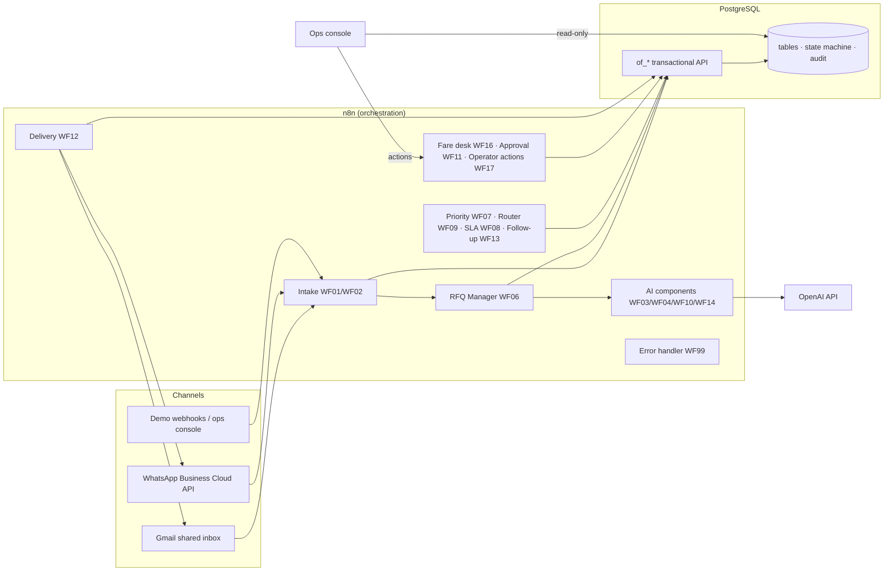
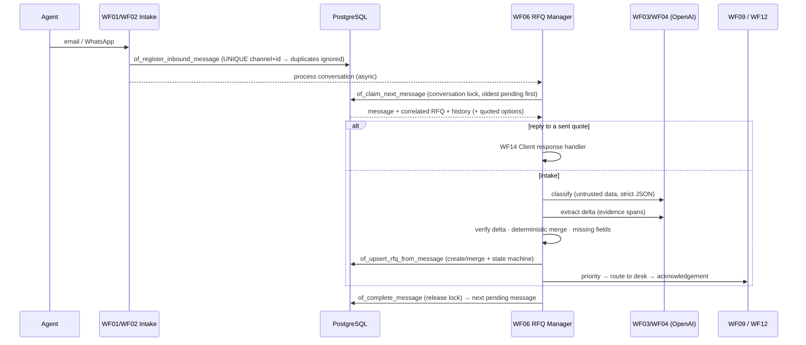

# Architecture

## 1. Layers

| Layer | Responsibility | Why |
|---|---|---|
| **n8n workflows** | Sequencing, channel I/O, retries, scheduling, calling AI | Visual, maintainable by the operations team, official connectors |
| **`lib/` (JavaScript)** | Deterministic business rules: normalisation, date parsing, validation, merging, priority, routing, quote rendering and checks, reply interpretation, follow-up / SLA rules | Unit-tested outside n8n; the *same code* is bundled into the n8n Code nodes by `scripts/build-workflows.js` |
| **PostgreSQL `of_*` functions** | Transactional writes: idempotent registration, locks, RFQ upsert, state transitions, quote versioning, approvals, deliveries, alerts, audit | Atomic and race-free: two WhatsApp messages arriving together can't create two RFQs, and an illegal transition is refused even if a workflow is buggy |
| **OpenAI** | Language understanding and wording only | Every output is schema-constrained and verified by `lib/` |
| **Ops console** | Human interface for the fare desk, approvers and the demo | Reads with a read-only role; every action goes through n8n webhooks, so it is orchestrated and audited |

## 2. Message lifecycle

### Conversation correlation (in order)
1. RFQ number quoted in the subject/body (`OFF-RFQ-2026-000031`) and owned by the same contact or agency.
2. Open RFQ of the same conversation (email thread / WhatsApp number) updated within `CORRELATION_WINDOW_HOURS`. When several are open, a reply-like message ("option 2", "go ahead", "too expensive") goes to the one awaiting a reply to its quote.
3. The contact's **single** open RFQ on another channel (cross-channel replies), ignored if the message names a route of its own.

### Request merging
The extractor returns only what the **current** message states (a *delta*). `mergeRequirements()` applies it deterministically: scalars override, airline lists are combined (with exclusions removing preferences), urgency only escalates, and a return date implies a round trip. A message describing a different route is a **new** RFQ unless it explicitly changes the current one.

## 3. AI usage and guardrails

| Component | Model output | Code guard |
|---|---|---|
| WF03 classifier | intent, confidence, requires_human | enum check, confidence < 0.70 → human, OTHER → human |
| WF04 extractor | delta + evidence spans | dates re-parsed from the span (ambiguous → rejected, wrong year → corrected), locations / airlines / cabin / pax must appear in the text, past dates and return < departure rejected |
| WF10 formatter | email + WhatsApp text | every fare/penalty/baggage/date string verbatim, **no number outside the fare data**, disclaimer mandatory, commitment words forbidden → else template |
| WF14 reply classifier | action + option | a selection must be backed by the message (number, ordinal, unique airline); disagreement → confirmation question |

If OpenAI times out, returns invalid JSON or refuses, or if `AI_PROVIDER=rules`, deterministic fallbacks produce the same output shape (`source = rules`), so the pipeline never stops.

## 4. Reliability

| Concern | Mechanism |
|---|---|
| Duplicate email / webhook | `UNIQUE (channel, external_message_id)` on inbound messages |
| Concurrent WhatsApp burst | per-conversation lock (`conversations.locked_until`) + ordered processing + self re-trigger |
| Crashed processing | sweeper (every minute) requeues stale `PROCESSING` and orphan `PENDING` messages |
| Workflow failure | WF99: error logged (secrets redacted), message `FAILED` → retry after 1/5/15 min → `DEAD_LETTER` + alert, manual retry from the console |
| Duplicate follow-up | `UNIQUE (rfq_id, quote_id, sequence_no)` claim before sending |
| Duplicate SLA alert | `alerts.dedupe_key` per RFQ / status episode |
| Illegal status change | `rfq_status_transitions` checked in `of_transition_rfq` |
| Wrong quote approved | only the latest pending version, not expired, with acknowledged edit warnings |

## 5. Observability
- `workflow_events`: structured log (workflow, execution, rfq, conversation, event, status, duration). No keys or tokens.
- `audit_logs`: business audit (MESSAGE_RECEIVED, AI_CLASSIFIED, RFQ_CREATED, PRIORITY_CALCULATED, ASSIGNED, FARES_ADDED, QUOTE_GENERATED, QUOTE_APPROVED, QUOTE_SENT, FOLLOWUP_SENT, CLIENT_REPLIED, BOOKING_REQUESTED, STATUS_CHANGED, SECURITY_FLAGGED…).
- `rfq_status_history`: every transition with actor and reason (feeds the SLA and response-time metrics).
- n8n execution history (14 days).

## 6. Deployment (docker-compose)

| Service | Image | Notes |
|---|---|---|
| `postgres` | postgres:16-alpine | business DB `offshore_fares` + n8n DB `n8n`; init script loads schema, functions, demo data and the read-only role |
| `n8n-init` | n8nio/n8n | one-shot: credentials from `.env` → encrypted n8n credentials, import + publish workflows (skipped on later starts) |
| `n8n` | n8nio/n8n | receives **no secrets** in its environment, only business settings |
| `ops-console` | node:22-alpine | read-only DB role + n8n webhooks |

Production: n8n queue mode with workers, managed PostgreSQL, HTTPS reverse proxy, n8n external secrets, backups. See [future-integrations.md](future-integrations.md).
