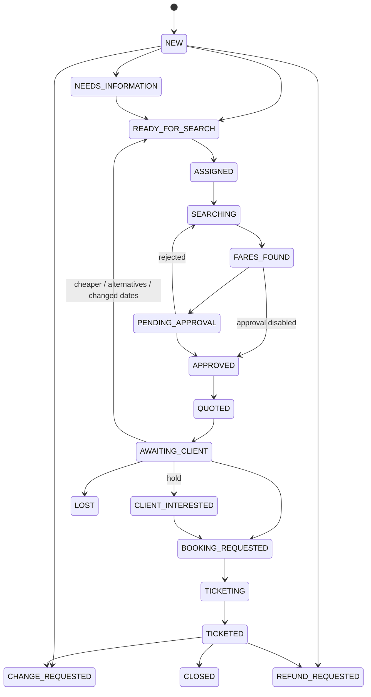

# Business process

## 1. End-to-end flow (demo story)

| # | Step | Example (Apex Travel / John Carter) | Status |
|---|---|---|---|
| 1 | Request arrives | Email *"Need 3 business class seats from Mumbai to London… 17 Nov, return 25 Nov… Qatar preferred… urgently"* | `NEW` |
| 2 | AI understands | NEW_QUOTE · BOM → LHR · round trip · 3 adults · Business · Qatar + Emirates · ±1 day · urgent | |
| 3 | RFQ created | `OFF-RFQ-2026-000031` | `READY_FOR_SEARCH` |
| 4 | Priority | Business +20, 3 premium pax +10, VIP agency +15, urgent +10 = **55 HIGH** | |
| 5 | Routed | Premium Desk → least-loaded operator (Aisha Khan); acknowledgement with a recap is sent to John | `ASSIGNED` |
| 6 | Fares | Operator enters 3 options (Qatar USD 2,450 · Emirates USD 2,610 · BA USD 2,890) | `SEARCHING` → `FARES_FOUND` |
| 7 | Quote | AI writes email + WhatsApp versions; numbers verified | `PENDING_APPROVAL` |
| 8 | Approval | Aisha approves (who, when, version, content hash stored) | `APPROVED` |
| 9 | Delivery | Reply in John's email thread | `QUOTED` → `AWAITING_CLIENT` |
| 10 | Follow-up | +4 h and +24 h if no answer (stops on reply / booking / opt-out) | |
| 11 | Agent replies | *"Option 2 looks good, please proceed."* → OPT-002 Emirates | `BOOKING_REQUESTED` |
| 12 | Handoff | Ticketing Desk gets the summary (agency, contact, pax, option, fare, dates, notes) | |
| 13 | Ticketing (human) | Ticketing desk revalidates, books, records the PNR | `TICKETING` → `TICKETED` |

## 2. Status machine

(Cancellations, `ERROR` recovery and closing are also allowed where it makes sense; the full table is `rfq_status_transitions` in `database/schema.sql`, mirrored by `lib/stateMachine.js`.)

## 3. Mandatory information before a fare search
origin · destination · departure date · trip type (and return date for a round trip) · adults ≥ 1 · cabin.
Multi-city: at least 2 segments, each with origin, destination and date.

## 4. Priority rules (configurable)
| Rule | Points |
|---|---|
| Travel < 24 h | +40 |
| Travel < 72 h | +25 |
| First / Business | +25 / +20 |
| Group (≥ `GROUP_MIN_PASSENGERS`, default 10) | +20 |
| 3+ passengers in Business/First *(addition, documented)* | +10 |
| VIP agency | +15 |
| Explicit urgency | +10 |
| Change / cancellation / refund with travel < 24 h | +30 |

0–29 LOW · 30–49 NORMAL · 50–69 HIGH · 70–100 CRITICAL.

## 5. Routing rules
Booking / change / cancellation / baggage → **Ticketing Desk** · refund → **Refund Desk** · group → **Group Desk** · Business / First / Premium Economy → **Premium Desk** · payment / general / other → **General Desk**. The operator is the active member of the desk with the fewest open assignments.

## 6. SLAs (minutes in status, CRITICAL × 0.5)
NEW 5 · READY_FOR_SEARCH 10 · ASSIGNED 15 · SEARCHING 45 · FARES_FOUND 10 · PENDING_APPROVAL 10 · BOOKING_REQUESTED 5 · CHANGE_REQUESTED 15 · REFUND_REQUESTED 60. Statuses waiting on the agent (NEEDS_INFORMATION, AWAITING_CLIENT) have no internal SLA.

## 7. What always involves a human (POC policy)
- every quote (unless `REQUIRE_HUMAN_APPROVAL=false`);
- fares, penalties, baggage, availability, so the fare desk is the source;
- change / cancellation / refund requests, which become tasks and never get an automatic penalty answer;
- booking and ticketing (handoff only);
- low-confidence classification (< 0.70), unknown senders, suspected prompt injection, general / payment / baggage questions (with knowledge-base suggestions);
- RFQs still incomplete after `MAX_CLARIFICATIONS`.

## 8. Business value

| Before | With the orchestrator |
|---|---|
| Every email / WhatsApp read and re-typed | Requirements extracted into a structured RFQ in seconds |
| Missing details chased by hand | One precise clarification, sent automatically |
| WhatsApp fragments lost across messages | Bursts merged into one RFQ |
| Requests forgotten or answered late | Live queue, priorities, SLA alerts |
| Quotes copy-pasted twice (email + WhatsApp) | Generated once, both formats, numbers verified |
| Manual follow-ups | Automatic, polite, capped, cancelled on reply |
| No trace of who sent what | Complete audit trail, approval history with content hash |
| AI risk | AI never sets a price; human approval before anything commercial is sent |

Benefits: less manual email handling, faster responses, structured RFQs, less copy-paste, fewer forgotten requests, a unified email + WhatsApp workflow, automated follow-ups, SLA tracking, better prioritisation, human-controlled AI, a complete audit trail, and readiness for GDS/CRM integration.

## 9. Assumptions (to validate with Offshore Fares)
| Assumption | Where to change it |
|---|---|
| Agents are known contacts (email / WhatsApp number); unknown senders are accepted but flagged UNVERIFIED | `contacts`, console |
| Agency matched by email domain | `agencies.email_domain` |
| Numeric dates are day-first (DMY) | `lib/dates.js` |
| A city maps to its main airport (London → LHR, New York → JFK) | `lib/airports.js`, operator can change it |
| "next Friday" is ambiguous and needs confirmation | `lib/dates.js` |
| Group = 10+ passengers | `GROUP_MIN_PASSENGERS` |
| Quotes valid until the earliest fare validity | `lib/fares.js` |
| Reply on the channel of the agent's latest message | `WF12` plan |
| A cancellation of a ticketed booking is handled as REFUND_REQUESTED (type CANCELLATION) | `of_create_after_sales_case` |
| Business timezone UTC | `BUSINESS_TIMEZONE` |
| Follow-ups at 4 h and 24 h, max 2 | `FOLLOWUP_*` |
