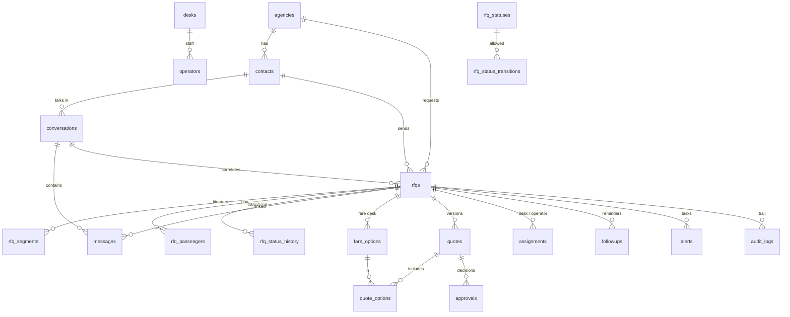

# Database (PostgreSQL)

Files: `database/schema.sql` (tables, constraints, indexes, reference data) · `database/functions.sql` (transactional API) · `database/seed.sql` (demo data, generated by `npm run build:seed`) · `database/tests/api_flow_test.sql`.

## Tables

| Table | Purpose | Notable constraints |
|---|---|---|
| `agencies` | Travel agencies (name, code, email domain, VIP level, preferred channel) | `code`, `email_domain` unique |
| `contacts` | Travel agents | unique `lower(email)`, unique `whatsapp_phone`; `verification_status`, `opted_out_followups` |
| `conversations` | Email thread or WhatsApp number | `UNIQUE(channel, external_thread_id)`; `locked_until` processing lock |
| `messages` | Inbound and outbound messages | **`UNIQUE(channel, external_message_id) WHERE direction='INBOUND'`** (idempotency); processing status, retries, delivery status |
| `rfqs` | Requests for quote | `rfq_number` `OFF-RFQ-YYYY-NNNNNN`; status FK to `rfq_statuses`; requirements jsonb + key columns; priority, SLA flag, handoff |
| `rfq_segments`, `rfq_passengers` | Itinerary legs, pax counts by type (no names) | |
| `rfq_status_history` | Every transition with actor and reason | |
| `fare_options` | Options from the fare desk / provider | amount `numeric(12,2) > 0`, currency, penalties, baggage, validity, source, verified, batch |
| `quotes`, `quote_options` | Quote versions (texts + structured model + validation report + content hash) | `UNIQUE(rfq_id, version)` |
| `approvals` | APPROVE / EDIT / REJECT / AUTO_APPROVE with who, when, note, version, hash, snapshot | |
| `assignments` | Desk / operator assignment history | one current per RFQ |
| `followups` | Follow-up attempts | `UNIQUE(rfq_id, quote_id, sequence_no)` |
| `alerts` | Desk notifications, human tasks, SLA breaches, security flags, delivery failures, workflow errors | `dedupe_key` unique |
| `audit_logs` | Business audit trail | |
| `workflow_events` | Structured technical log | |
| `workflow_errors` | Failures captured by WF99 | |
| `knowledge_base` | Procedures / FAQ with full-text search | never used for fares or rules |
| `rfq_statuses`, `rfq_status_transitions`, `desks`, `operators`, `rfq_counters` | Reference data and the RFQ number sequence | |

## API functions (one jsonb in, jsonb out)

| Function | Used by | What it guarantees |
|---|---|---|
| `of_register_inbound_message` | WF01/WF02 | duplicate detection, contact/agency identification (or UNVERIFIED contact), conversation upsert |
| `of_update_delivery_status` | WF02 | WhatsApp receipts, forward-only (SENT < DELIVERED < READ) |
| `of_claim_next_message` / `of_complete_message` / `of_sweep` | WF06 | per-conversation lock, ordered processing, correlation, recovery |
| `of_upsert_rfq_from_message` | WF06, WF14 | create or merge an RFQ, segments/pax, status decision, debounce, security alert |
| `of_transition_rfq` / `of_transition_path` | all | **refuses illegal transitions**, history + audit |
| `of_save_priority`, `of_assign_rfq` | WF07, WF09 | priority audit, least-loaded operator, desk notification |
| `of_due_clarifications`, `of_mark_clarification` | WF05 | claim (no double send), never the same question twice, escalation |
| `of_save_fare_options` | WF16 | allowed statuses, new batch, option codes `OPT-001…` |
| `of_get_quote_context`, `of_create_quote`, `of_get_quote`, `of_quote_decision` | WF10, WF11 | versioning, approval rules (latest, not expired, warnings acknowledged), hash |
| `of_get_delivery_context`, `of_record_outbound` | WF12 | channel data, quote SENT, `APPROVED → QUOTED → AWAITING_CLIENT`, first response time |
| `of_followup_candidates`, `of_claim_followup`, `of_record_followup` | WF13 | unique claim, RECHECK_FARE task for expired quotes |
| `of_sla_candidates`, `of_record_sla_breaches` | WF08 | deduplicated alerts |
| `of_record_client_decision` | WF14 | booking handoff summary, hold, back to the desk, lost, review |
| `of_create_after_sales_case` | WF15 | find the booking (PNR / date) or open a case for a human |
| `of_operator_action` | WF17 | human actions through the state machine |
| `of_flag_message`, `of_kb_search` | WF06 | human tasks with KB suggestions, security alerts, opt-out |
| `of_record_workflow_error` | WF99 | backoff 1/5/15 min, dead letter after 3 failures |

## Roles
- `offshore` (owner): n8n credential *Offshore Fares DB*.
- `ops_console`: **SELECT only**, used by the dashboard.

## Migrations
The schema is applied on first start. Forward-only migrations go in `database/migrations/` (see its README).
